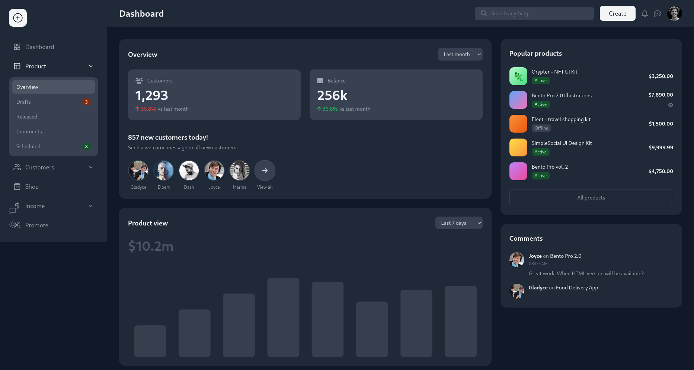

# Dashboard Template




A responsive, dark-mode enabled dashboard template with reusable components.

## File Structure

```
/
├── components/
│   ├── sidebar.html        # Reusable navigation sidebar
│   └── topbar.html         # Reusable header/topbar
├── js/
│   └── components.js       # Component loader and shared functions
├── dashboard.html          # Main dashboard page
├── chat.html              # Chat interface page
├── auth.html              # Sign in/sign up page
├── error-404.html         # 404 error page
├── error-500.html         # Server error page
└── error-403.html         # Forbidden error page
```

## Components

### Sidebar (`components/sidebar.html`)
- Navigation menu with icons
- Animated submenu for Product section
- Chat and dark mode toggle buttons
- Responsive (mobile collapsible)

### Topbar (`components/topbar.html`)
- Page title (dynamically set)
- Search bar
- Create button
- Notification and message icons
- User avatar
- Mobile hamburger menu

### Components Loader (`js/components.js`)
- Loads HTML components dynamically
- Initializes event listeners
- Provides shared functions:
  - `toggleMobileSidebar()` - Toggle sidebar on mobile
  - `toggleSubmenu()` - Toggle Product submenu
  - Dark mode toggle handler

## Features

- **Dark Mode**: System preference detection with localStorage persistence
- **Responsive Design**: Mobile-first with breakpoints at 1024px
- **Smooth Animations**: CSS transitions and keyframe animations
- **Reusable Components**: Sidebar and topbar shared across pages
- **Chart Integration**: Chart.js for analytics (dashboard)
- **Modern UI**: Tailwind CSS v3 styling

## Usage

1. Open any HTML file in a web browser
2. Components (sidebar/topbar) load automatically via JavaScript
3. All pages share the same navigation and styling

## Customization

To modify shared components:
- Edit `components/sidebar.html` for navigation changes
- Edit `components/topbar.html` for header modifications
- Changes automatically reflect across all pages using the components

## Technologies

- **Tailwind CSS v3**: Utility-first CSS framework
- **Chart.js**: For data visualization
- **Font Awesome 6.4.0**: Icon library
- **Vanilla JavaScript**: No framework dependencies
